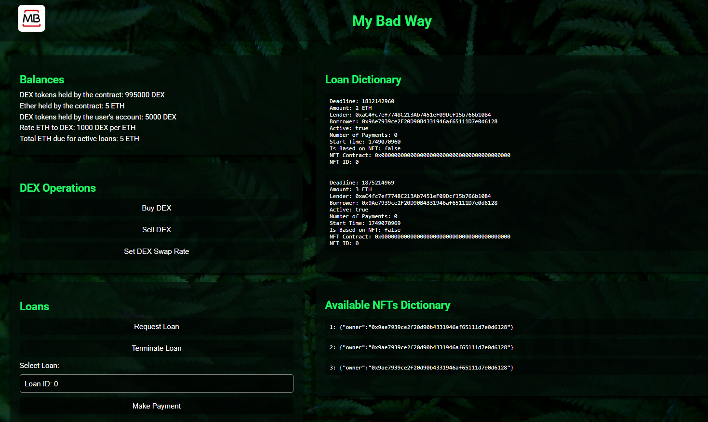

# Decentralized Finance

## Authors - Group 18

- André Reis - fc58192  
- Daniel Nunes - fc58257  
- Gonçalo Pinto - fc58178  

Faculdade: [Faculdade de Ciências da Universidade de Lisboa](https://ciencias.ulisboa.pt/)

---

## Project Overview

This project is a **Decentralized Finance platform** built on Ethereum, allowing users to interact with a custom ERC20 token (DEX), request and fund loans using both tokens and NFTs as collateral, and manage loan payments and settlements in a trustless way.

### Main Features

- **DEX Token:** Buy and sell a custom ERC20 token (DEX) using ETH at a swap rate.
- **Standard Loans:** Request loans by locking DEX tokens as collateral and receive ETH.
- **NFT-Backed Loans:** Request loans using NFTs as collateral. Other users can fund these loans, and the NFT is held by the contract until the loan is repaid or defaulted.
- **Loan Lifecycle:** Make periodic payments, terminate loans early, or claim collateral in case of default.
- **Admin Controls:** The contract owner can update the DEX swap rate and trigger smart loan checks.

---

## Project Preview



---

## Project Description

### Architecture

The project consists of three main components:

1. **Smart Contract:**  
   Implements the server-side logic using Solidity. It manages the ERC20 DEX token, NFT collateral, loan creation, payments, and collateral management. The contract uses OpenZeppelin libraries for ERC20 and ERC721 standards.

2. **JavaScript Client:**  
   Handles the client-side logic, interacting with the smart contract via Web3.js. It allows users to buy/sell DEX, request and fund loans, make payments, and view contract/account balances.

3. **HTML Frontend:**  
   Provides a user-friendly interface for interacting with the DeFi platform.

### Smart Contract Details

- **ERC20 DEX Token:** Custom fungible token for collateral and trading.
- **Loan Struct:** Tracks all loan details, including collateral, borrower, lender, amount, deadlines, status, number of payments done and the time of its creation.
- **Interest and Fees:** Loans accrue interest per period, and early termination incurs a fee.
- **Loan Management:** Functions for creating, funding, repaying, and terminating loans, as well as handling collateral transfer.
- **Events:** Emits events for loan creation.

### Usage Notes

- Only the contract owner has the authority to update the swap rate and monitor loan statuses.
- For testing purposes, the periodicity value received by the constructor has been set in minutes.
- To enhance user experience, all payment values required by the contract are calculated directly within the contract, eliminating the need for users to input unnecessary values.
- Some values on the front-end do not update automatically; therefore, the page must be refreshed when updates are needed.

---

## Getting Started

### Prerequisites

- Node.js and npm
- [Ganache](https://trufflesuite.com/ganache/) (for local Ethereum blockchain)
- [MetaMask](https://metamask.io/) extension in your browser

### 1. Setting up Ganache

Ganache allows you to run a personal Ethereum blockchain on your computer for development and testing.

- **Install Ganache:**  
  Download and install Ganache from [here](https://trufflesuite.com/ganache/).

- **Start Ganache:**  
  Open Ganache and start a new workspace or quickstart.  
  Note the RPC server URL (usually `http://127.0.0.1:7545` or `http://127.0.0.1:8545`) and the list of generated accounts with their private keys.

### 2. Connect Ganache Accounts to MetaMask

- Open MetaMask in your browser.
- Add a new network with the Ganache RPC URL, .
- Click on your account icon > **Import Account**.
- Copy a private key from Ganache and paste it into MetaMask to import the account.
- Repeat for as many accounts as you need for testing.

### 3. Deploy the Smart Contracts

- Use [Remix IDE](https://remix.ethereum.org/) or your preferred tool (Truffle/Hardhat) to deploy `decentralized_finance.sol` and `nft.sol` to your Ganache blockchain.
- Copy the deployed contract addresses and update them in `main.js`:
  ```js
  const defi_contractAddress = "YOUR_DEPLOYED_DEFI_CONTRACT_ADDRESS";
  const nft_contractAddress = "YOUR_DEPLOYED_NFT_CONTRACT_ADDRESS";
- Copy the respective abi strings to the specific abi files.

### 4. Connecting the Frontend to MetaMask

- When you open the project's `index.html` in your browser, MetaMask will display a pop-up asking for permission to connect to the site (localhost).
- Click **"Connect"** to allow the frontend to interact with your MetaMask account on the local Ganache network.
- Make sure the selected MetaMask account is one of the accounts imported from Ganache.